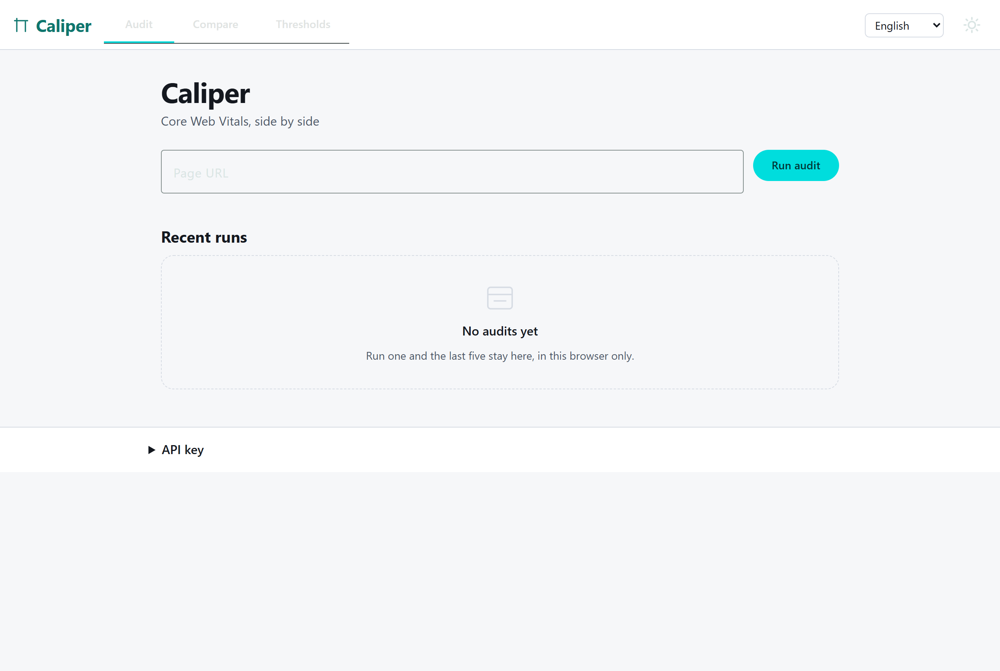
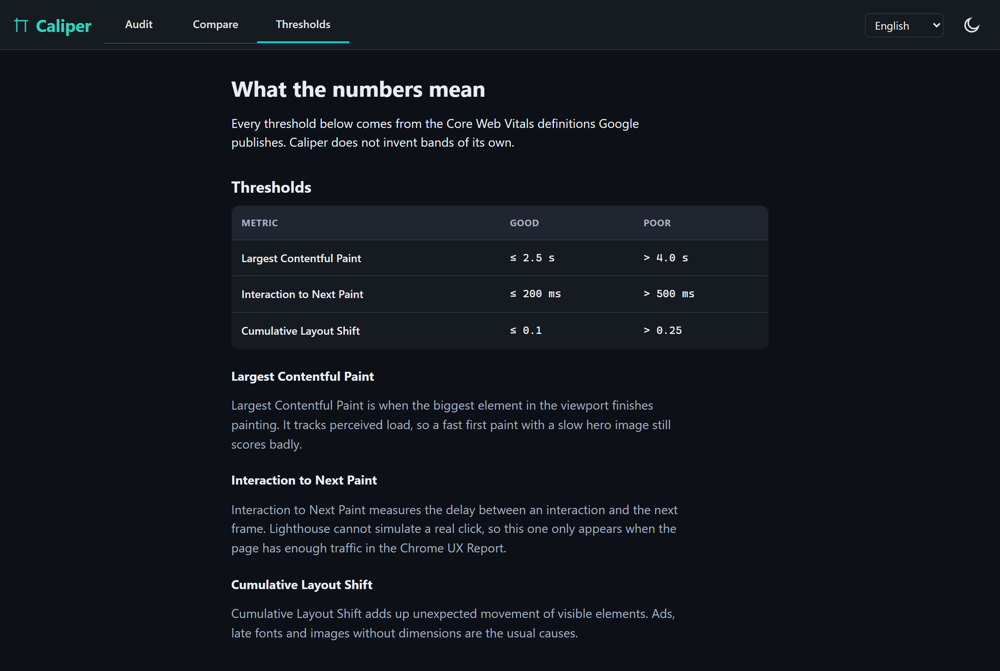

# Caliper

Angular app that runs PageSpeed Insights audits and puts the Core Web Vitals of several pages next to each other.

[](https://github.com/Filipespan/caliper/actions/workflows/ci.yml)

Demo: https://caliper.filipespan.workers.dev



## What it does

Type a URL and it runs the PageSpeed API twice, mobile and desktop, and shows both scores with the metrics that produced them. The last five runs stay on the home page, in localStorage.

The compare route takes two to four URLs, runs them one at a time and lines up the deltas against the first one, which acts as the baseline.

The thresholds route spells out where the good, needs improvement and poor bands sit, and why INP shows up for some pages and not for others.



No API key is required. There is a field for your own key if you run into quota limits, and it never leaves the browser.

## Why Angular, and what I would do differently

I picked Angular because the interesting part of this problem is coordination, not rendering. Two parallel requests, a serial queue, cancellation, retries with backoff: RxJS handles all of that in the language of streams, and the rest of the app is signals and templates.

The app is standalone and zoneless. Every component is OnPush, every dependency arrives through `inject`, and there is not a single NgModule.

What I would change: Angular Material costs more than it gives here. The toolbar, tabs, form field and snack bar push the initial bundle to 555 kB raw, 130 kB over the wire, and that alone is why the mobile Lighthouse score is 64 while the desktop score is 95. The four visual components that actually matter are mine and weigh almost nothing. If this were a product and not a portfolio piece, I would drop Material from the shell, keep it inside the lazy routes, and get most of that back.

Second thing I would change: the audit is a single Lighthouse run, so two runs of the same page can differ by a few points. Averaging three runs would be more honest, and three times slower.

## RxJS decisions

Four operators, four reasons. Nothing here is there to show range.

| Where | Operator | Why not the obvious alternative |
| --- | --- | --- |
| URL field, `audit-page.ts` | `debounceTime(400)` and `distinctUntilChanged` | Validating on every keystroke makes the error message blink while you are still typing the protocol. |
| Submit, `audit-page.ts` | `switchMap` | `mergeMap` would keep the abandoned run alive and let a stale response paint over a newer one. The old request has no value once the URL changes. |
| Both strategies, `psi.service.ts` | `forkJoin` | Mobile and desktop are independent. Running them in sequence would double the wall clock for nothing. |
| Compare queue, `compare-queue.service.ts` | `concatMap` | The PageSpeed API answers bursts with 429, which I hit repeatedly while building this. Serial requests are slower and they finish. |

Around those: `retry` with a `timer` backoff that only fires for network and 5xx failures, and a `catchError` that turns `HttpErrorResponse` into an `AuditError` carrying a kind and a message key. No transport type reaches a template.

One functional interceptor, `apiKeyInterceptor`, attaches the key when there is one.

Signals take over at the edge: `toSignal` exposes the stream to the template, and small `computed` values narrow the state union so the template can stay flat instead of nesting type guards.

## Testing

`npm test` runs Vitest through the Angular unit test builder. 48 tests over 7 files, 94% statement coverage on the files under test, with a 70% floor enforced in `vitest.config.ts`.

What is covered: the PSI client against `provideHttpClientTesting` (success, 4xx without retry, 5xx with two retries, cancellation through `switchMap`), the exact threshold boundaries for LCP, INP and CLS, URL validation including `javascript:` and missing protocols, locale fallback and persistence, serial ordering of the compare queue, and two component tests that assert against rendered DOM.

One of those component tests earned its keep immediately: the audit form used `(ngSubmit)` without an `NgForm` in the template, so nothing happened on submit and the page would have reloaded. See commit `fix(audit): submit the form without ngSubmit`.

`npm run test:karma` runs the same specs through Karma and Jasmine. Angular 21 still ships the Karma runner in `@angular/build:unit-test`, it is no longer the default, and the Angular team has been clear that Vitest is where the tooling is going. Keeping both here is deliberate: plenty of teams still have thousands of Jasmine specs, and the migration path matters more than the greenfield story. The API differences are thin enough that `src/testing/spy.ts` covers them.

`fakeAsync` and `tick` do not work in this app. They need `zone-testing`, and the app is zoneless, so the retry timings are driven by Vitest fake timers instead.

## Numbers

Lighthouse on the production build, served locally over gzip. Not on the deployed URL, so HTTPS and Brotli are missing and best practices takes a hit for it.

| Preset | Performance | Accessibility | Best practices | SEO |
| --- | --- | --- | --- | --- |
| Desktop | 95 | 100 | 81 | 100 |
| Mobile | 64 | 100 | 82 | 100 |

Desktop LCP is 1.4 s. Mobile LCP is 6.9 s under the simulated slow 4G connection, and the initial bundle is the reason, as described above. Lazy routes are small: 14 kB for the audit page, 8 kB for compare, 3 kB for the thresholds page.

The four SVG components (score gauge, metric bar, status pill, empty state) are hand written. A charting library for three simple shapes would have cost tens of kilobytes and given nothing back.

## Running locally and deploying

```bash
npm ci
npm start          # dev server on http://localhost:4200
npm test           # vitest
npm run test:karma # the same specs on karma and jasmine
npm run lint
npm run build      # production build into dist/caliper
npm run deploy     # build, then wrangler deploy to Cloudflare Workers
```

Deploying needs a Cloudflare account with `wrangler login` already done. The Worker serves the built assets and falls back to `index.html` so client side routes survive a refresh.

TODO: an average of three runs per URL, behind a toggle, so single run variance stops being a footnote.

## License

MIT
